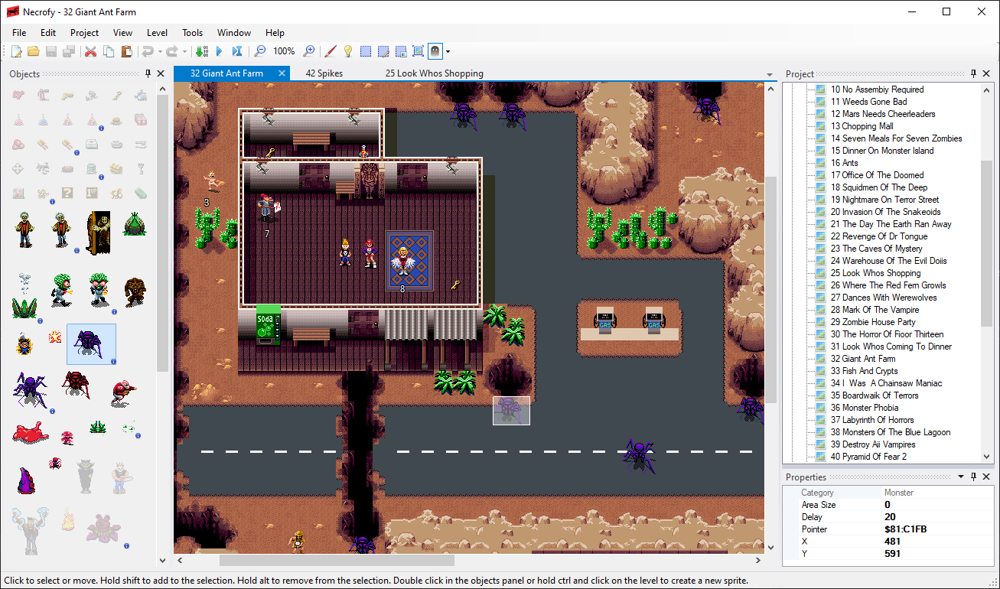
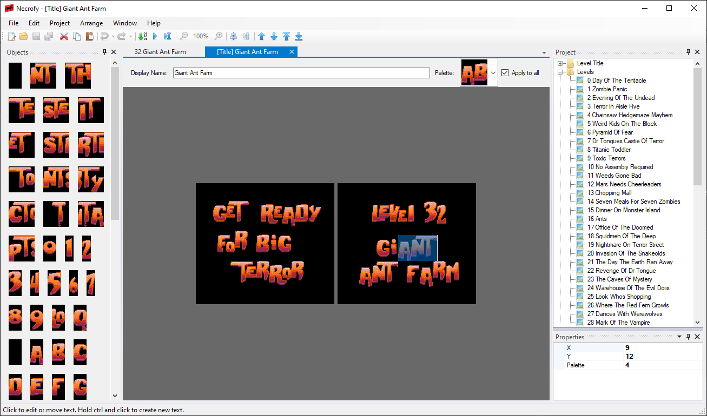
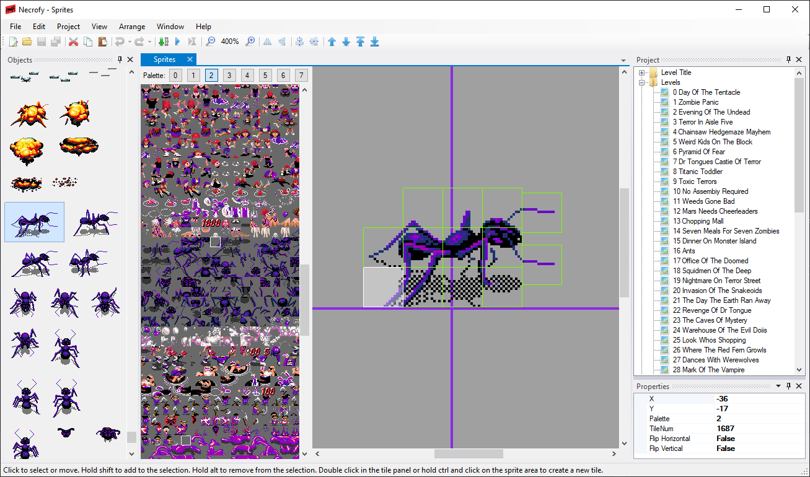

=======

Necrofy is a project-based level editor and ROM hacking tool for the SNES release of Zombies Ate My Neighbors.

  

Libraries used:
* asar https://github.com/RPGHacker/asar
* Json.NET https://www.newtonsoft.com/json
* DockPanel Suite http://dockpanelsuite.com/
* Drop-Down Controls https://github.com/BradSmith1985/DropDownControls
